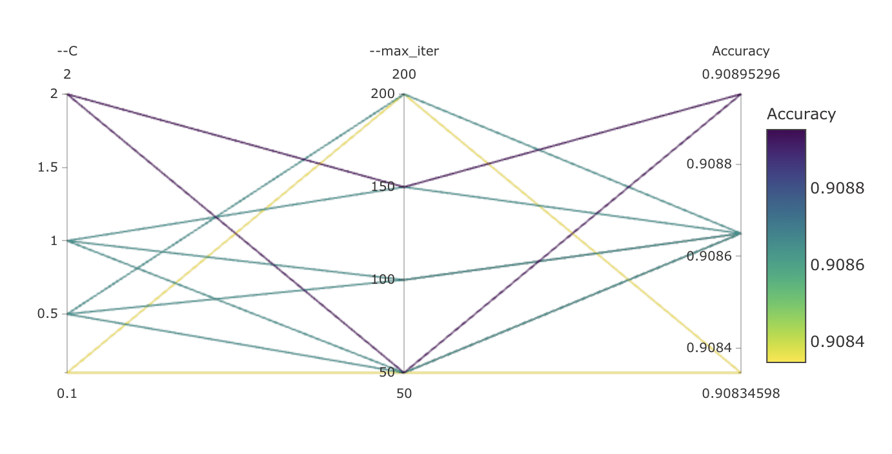
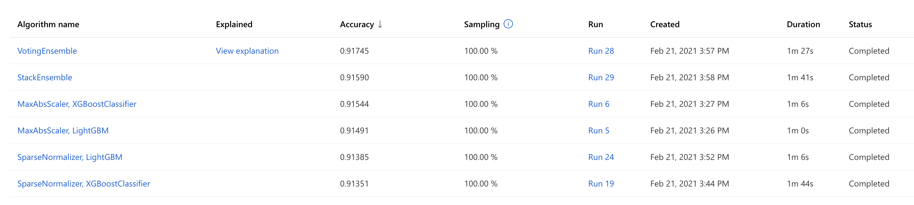
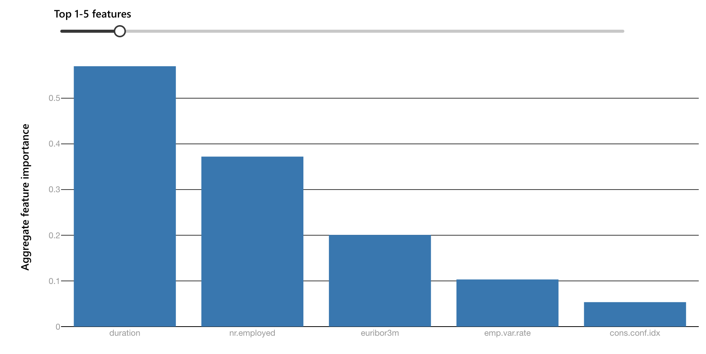
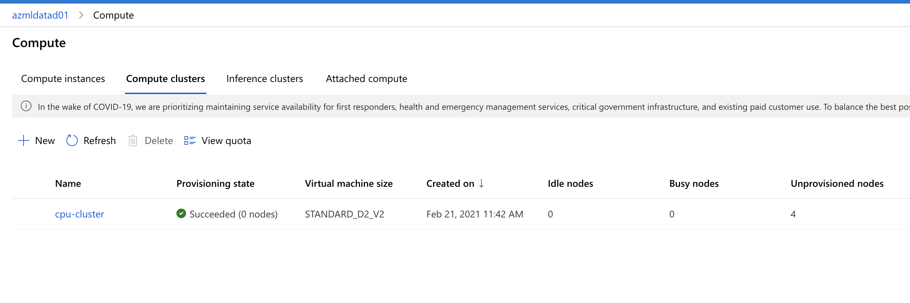
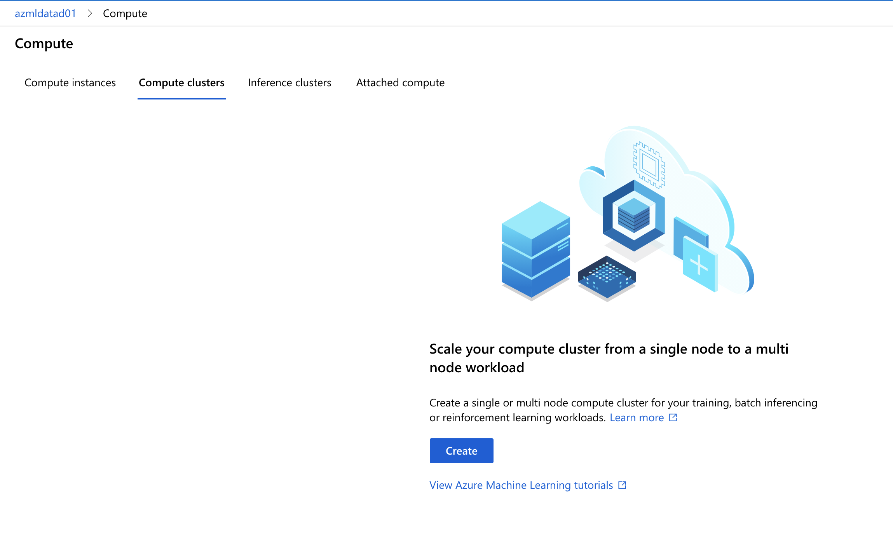

# Optimizing an ML Pipeline in Azure

## Overview
This project is part of the Udacity Azure ML Nanodegree.
In this project, I built and optimized an Azure ML pipeline using the Python SDK and a provided Scikit-learn model.
This model is then compared to an Azure AutoML run.

The diagram below shows the main steps of creating and optimizing an ML pipeline:


## Summary
**In 1-2 sentences, explain the problem statement: e.g "This dataset contains data about... we seek to predict..."**

This <a href="https://automlsamplenotebookdata.blob.core.windows.net/automl-sample-notebook-data/bankmarketing_train.csv">dataset</a> contains data about direct marketing campaigns of a banking institution. The marketing campaigns were based on phone calls. Often, more than one contact to the same client was required, in order to access if the product (bank term deposit) would be ('yes') or not ('no') subscribed. So, I seek to predict if the client will subscribe a term deposit in order to make a better effective campaign through advertisements.

**In 1-2 sentences, explain the solution: e.g. "The best performing model was a ..."**

The best performing model was **Voting Ensemble** with an accuracy of **91.745%** using the AutoML approach. 

I first created and optimized the hyperparameters of a standard Scikit-learn Logistic Regression using **HyperDrive**. I performed 24 runs to find the best hyperparameters using HyperDrive and the highest reported accuracy was **90.895%**. 



After that, I use **AutoML** to build and optimize a model using the same dataset, so that I can compare with the results obtained before. Similarly, I performed 24 iterations but the best model was a **Voting Ensemble** with an accuracy of **91.745%**



## Scikit-learn Pipeline
**Explain the pipeline architecture, including data, hyperparameter tuning, and classification algorithm.**

The pipeline architecture consists of tuning the hyperparameters of a logistic regression binary classification model using HyperDrive. First, I start by setting up a training script **'train.py'**, where I create a dataset, train and evaluate a logistic regression model from Scikit-learn. After that, I use Jupyter Notebook and Azure ML Python SDK to get the workspace and experiment, create a compute cluster, create an estimator from the training script **'train.py'**, configurate the hyperdrive with the estimator, a parameter sampler and an early stopping policy, and finally run the experiment.

I use two of the most important hyperparameters of Sklearn Logistic Regression:
* **--C** (float, default: 1.0) – Inverse of regularization strength. Smaller values cause stronger regularization.
* **--max_iter** (int, default: 100) – Maximum number of iterations to converge.

**What are the benefits of the parameter sampler you chose?**

I use **RandomParameterSampling** method over the hyperparameter search space to randomly select values for C (choice among discrete values **0.01, 0.1, 0.5, 1.0, 1.5, 2.0, 3.0**) and max_iter (choice among discrete values **50, 100, 150, 200**) hyperparameters. Random sampling supports both discrete and continuous hyperparameters and allows us to refine the search space to improve results.

I chose the ```RandomParameterSampling```, the hyperparameters are randomly selected from the search space. The search space for the two hyperaparameters is the following:

```
   '--C' : choice(0.01, 0.1, 0.5, 1.0, 1.5, 2.0, 3.0),
   '--max_iter': choice(50, 100, 150, 200)
```

where the choice define discrete space over the values. The benefits of the ```RandomParameterSampling```, is that it is more fast than for example the ```GridParameterSampling``` where all the possible values from the search space are used, and it supports early termination of low-performance runs.

**What are the benefits of the early stopping policy you chose?**

I also use **BanditPolicy** which defines an early termination policy based on **evaluation_interval=2** and **slack_factor=0.1**. The evaluation_interval is the frequency of applying the policy, and the slack_factor is the ratio used to calculate the allowed distance from the best performing experiment run.

I chose the ```BanditPolicy``` which is an "aggressive" early stopping policy with the meaning that cuts more runs than a conservative one like the ```MedianStoppingPolicy```, so it saves computational time. There are three configuration parameters ```slack_factor, evaluation_interval(optional), delay_evaluation(optional)```. 

* ```slack_factor/slack_amount``` : (factor) The slack allowed with respect to the best performing training run.(amount) Specifies the allowable slack as an absolute amount, instead of a ratio.

* ```evaluation_interval``` : (optional) The frequency for applying the policy.

* ```delay_evaluation``` : (optional) Delays the first policy evaluation for a specified number of intervals.

I set ```evaluation_interval=2, slack_factor=0.1```.

The parameters generated by the HyperDrive run are:

Best Run ID: HD_f6d5b016-d770-47cf-bfa4-61d1e59014ca_17
Accuracy: 0.909
Parameters: ['--C', '2', '--max_iter', '50']

## AutoML
**In 1-2 sentences, describe the model and hyperparameters generated by AutoML.**

Unlike the previous approach, AutoML tries different models and algorithms during the automation and tuning the process within a specified period of time. The best performing model was the **Voting Ensemble** with an accuracy of **91.745%**.

The top 5 features that contributed to the good classification performance are shown below: **duration, nr.employed, euribor3m, emp.var.rate, cons.conf.idx**.



## Pipeline comparison
**Compare the two models and their performance. What are the differences in accuracy? In architecture? If there was a difference, why do you think there was one?**

The best model using AutoML was a **Voting Ensemble** with an accuracy of **91.745%**, unlike the logistic regression using the HyperDrive with an accuracy of **90.895%**. The improvement is about of 0.94% that is not a significant improvement. AutoML is definitely better than the HyperDrive in terms of architecture since I can create and train hundreds of models.

## Future work
**What are some areas of improvement for future experiments? Why might these improvements help the model?**

It would have been interesting to perform feature engineering to get a significant improvement, rather than keep testing with more hyperparameter tuning.

After feature engineering, I can also tune other hyperparameters used in Sklearn Logistic Regression in order to achieve better results. Using different parameter sampling techniques (for example Bayesian technique) and tuning the arguments of the BanditPolicy can also be useful.

About the AutoML, I would like to increase experiment timeout minutes in order to enable us to test more models and thus improving the performance.

## Proof of cluster clean up
**If you did not delete your compute cluster in the code, please complete this section. Otherwise, delete this section.**
**Image of cluster marked for deletion**

I cleaned up the resources used on my own Azure cloud Subscription.

