# Project #2: Operationalizing Machine Learning

## Table of Content
* [Overview](#overview)
* [Architectural Diagram](#architectural-diagram)
* [Key Steps](#architectural-diagram)
    * [Authentication](#authentication)
    * [Automated ML Experiment](#automated-ml-experiment)
    * [Deploy the best model](#deploy-the-best-model)
    * [Enable logging](#enable-logging)
    * [Swagger Documentation](#swagger-documentation)
    * [Consume model endpoints](#consume-model-endpoints)
    * [Create and publish a pipeline](#create-and-publish-a-pipeline)
* [Screen Recording](#screen-recording)
* [Standout Suggestions](#standout-suggestions)

## Overview
This is the second project of the Udacity Machine Learning Engineer with Microsoft Azure Nanodegree Program. I continued my work with the [Bank Marketing](https://automlsamplenotebookdata.blob.core.windows.net/automl-sample-notebook-data/bankmarketing_train.csv) dataset, but this time I used Azure to configure a cloud-based machine learning production model, deploy it and consume it. I also created, published, and consumed a ML pipeline in order to show how we can automate the deployment of a ML model using Python SDK.

## Architectural Diagram
These are the steps I followed in this project :

**Figure 1**: Mains steps for the Project

1. **Authentication** : I created a Service Principal (SP) in order to interact with the Azure ML Workspace because I worked in the free 30-day trial subscription that Azure offers when you create a new account.
2. **Automated ML Experiment** : I created an experiment using Automated ML, configure a compute cluster, and use that cluster to run the experiment.
3. **Deploy the best model** : I deployed the Best Model in order to interact with its HTTP API service, that is to interact with the model by sending data over POST requests.
4. **Enable logging** : I enabled logging because it helps me to monitor the deployed model in order to know the number of requests it gets, the time each request takes, etc.
5. **Swagger Documentation** : I consumed the deployed model using Swagger.
6. **Consume model endpoints** : I interacted with the endpoint using some test data to get inference.
7. **Create and publish a pipeline** : I automate this workflow by creating a pipeline with the Python SDK.

## Key Steps

### Authentication
I used the free 30-days subscription offered by Azure, so I had to do this step and create a Service Principal and associate it with the Azure ML Workspace.

First, I opened a cloud shell from the portal azure and install de Azure ML extension. After that, I created the Service Principal (SP).

**Figure 2**: Install the Azure ML extension and create SP
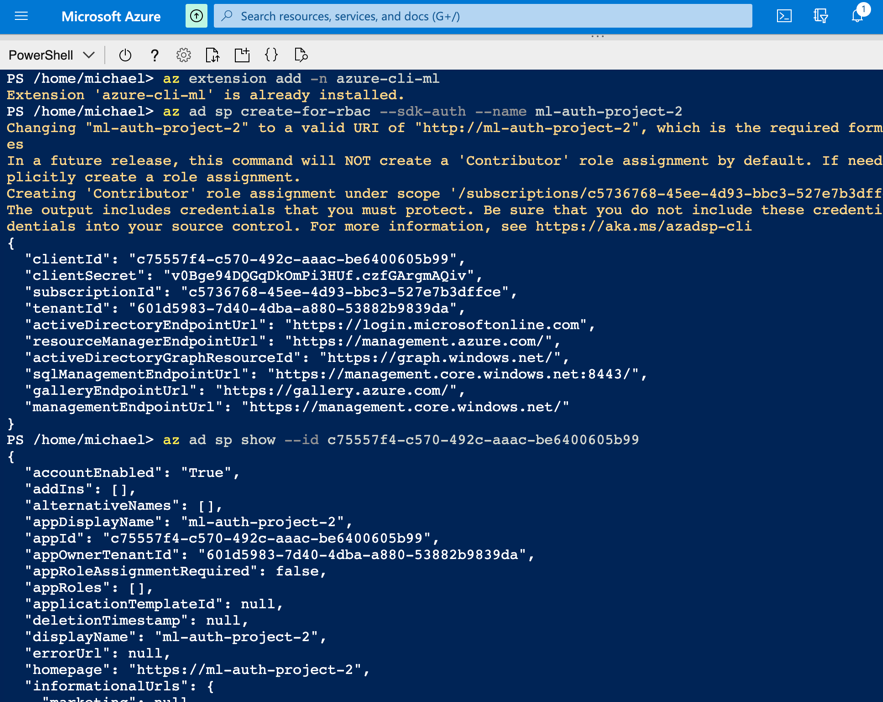

Then with the Object Id of the new Service Principal, I enabled its access to the workspace.

**Figure 3**: Allow the SP access to the workspace
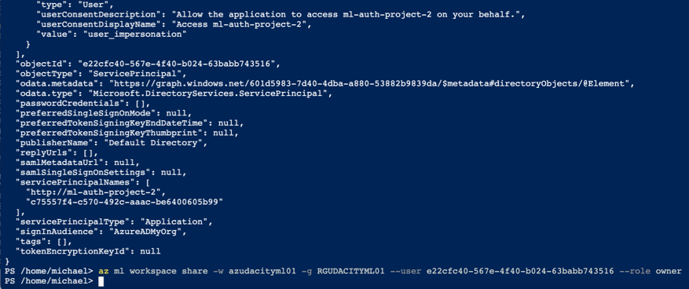

### Automated ML Experiment
In this step, I created an AutoML experiment to run using the **Bank Marketing** Dataset which was loaded in the Azure Workspace, choosing **'y'** as the target column.

First, I uploaded this dataset into the Azure ML Studio in the *Registered Dataset* Section using the url provided in the project.

**Figure 4**: Uploading from the dataset URL
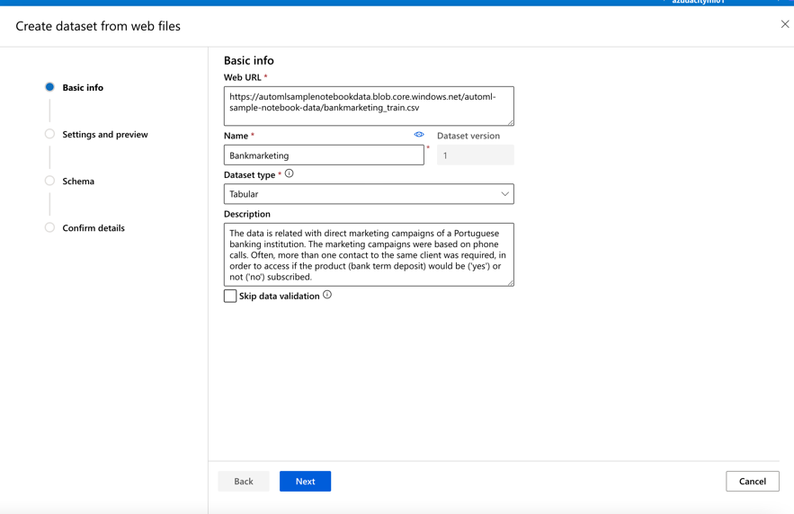

**Figure 5**: Settings and preview of the dataset
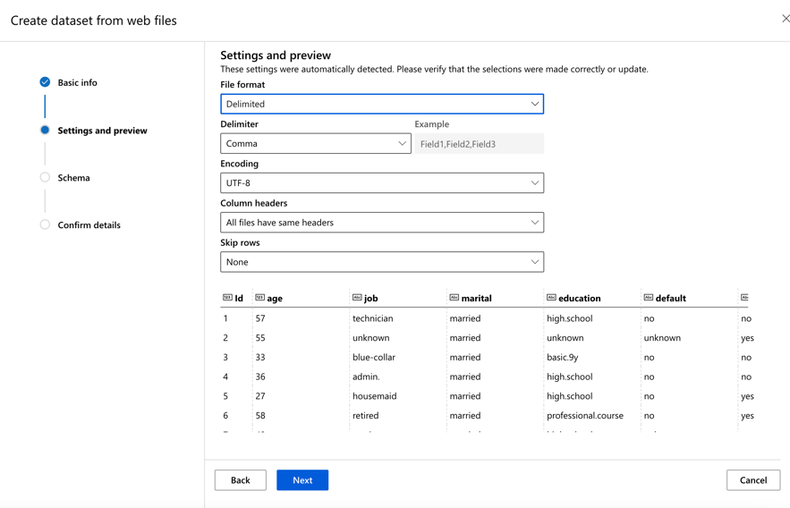

**Figure 6**: Schema of the dataset
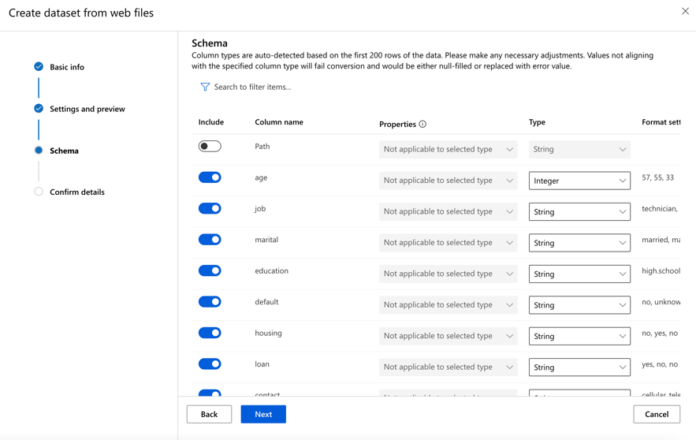

**Figure 7**: Confirm details

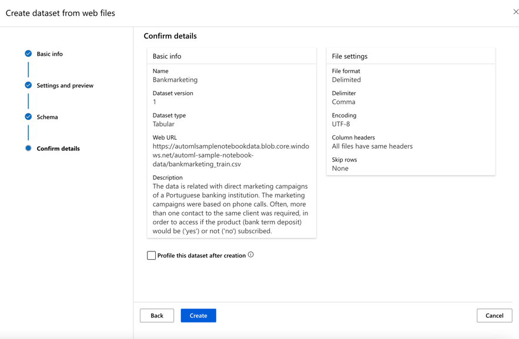

**Figure 8**: Registered dataset

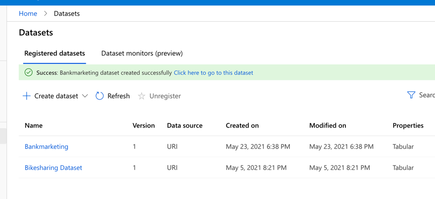

After that, I created the Auto ML run choosing the recently created dataset.

**Figure 9**: Selecting dataset in the Auto ML Run
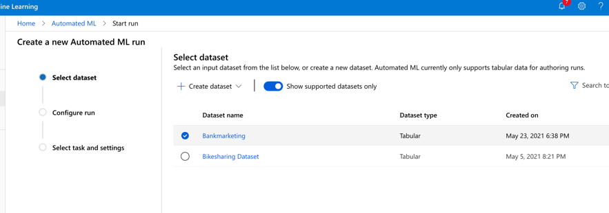

For the compute cluster, I configured the size of **Standard_DS12_v2** for the Virtual Machine and 1 as the minimum number of nodes. 

**Figure 10**: Selecting the vm size for the compute cluster
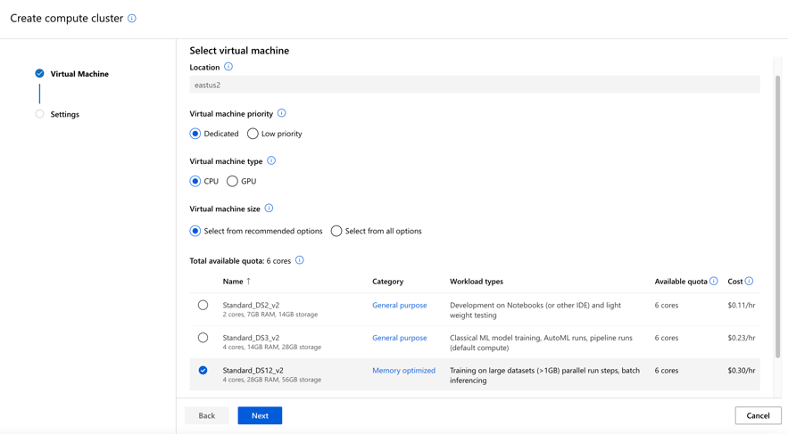

Due to I was working on a free subscription I coulnd't configurate more than 1 node in the *Maximum number of nodes*, but it wasn't a big problem. The experiment took approximately 1 hour.

**Figure 11**: Configuring # of nodes
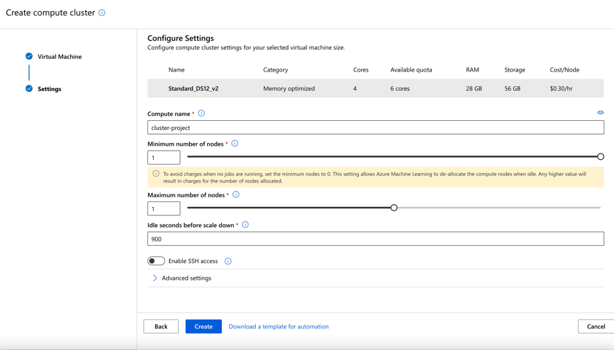

**Figure 12**: Configuring the experiment run
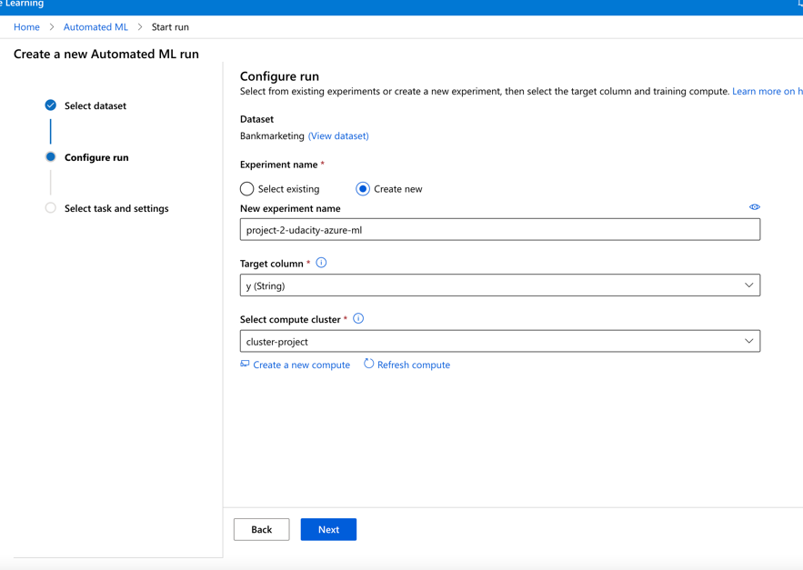

I ran the experiment using classification, without enabling Deep Learning. I enabled the *explain best model* option in order to interpret the results from the best model.

**Figure 13**: Additional configurations
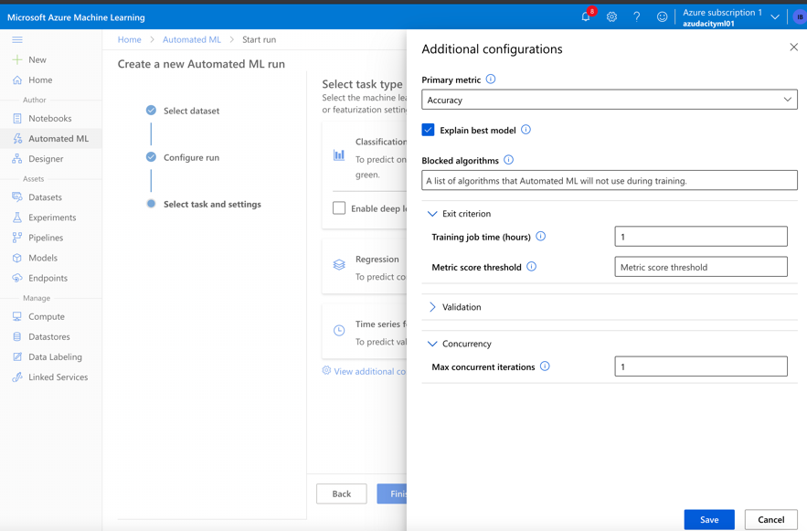

**Figure 14**: Select task type
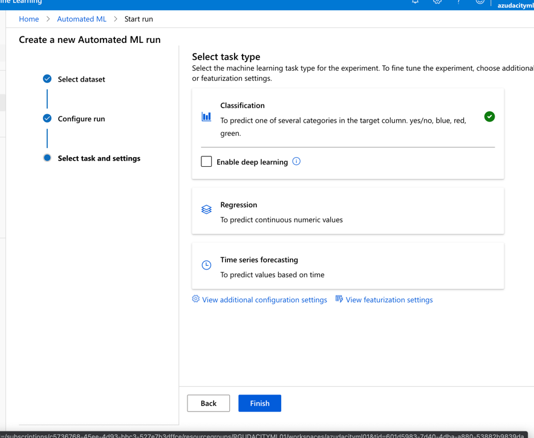

The run took approximately 1 hour to test various models and found the best model for the task. The best algorithm found is the **votingEnsemble** with an accuracy of 92%.

**Figure 14**: Experiment run details
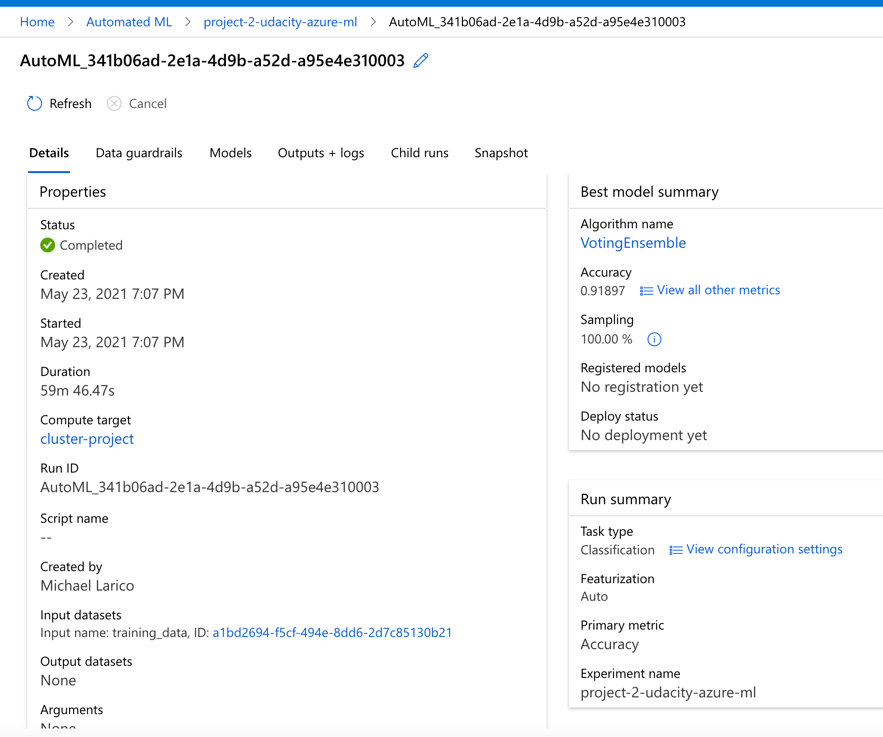

### Deploy the best model
To interact with the best chosen model for our task, we need to deploy it. This can be easily done in the Azure Machine Learning Studio, which provides us with an URL to send our test data to.

### Enable logging
Enabling Application Insights and Logs could have been done at the time of deployment, but for this project we achieved it using Azure Python SDK.

### Swagger Documentation
To consume our best AutoML model using Swagger, we first need to download the **swagger.json** file provided to us in the Endpoints section of Azure Machine Learning Studio.

### Consume model endpoints
Finally, it's time to interact with the model and feed some test data to it. We do this by providing the **scoring_uri** and the **key** to the **endpoint.py** script and running it.

#### (Optional) Benchmark
To do this, we make sure **Apache Benchmark** is installed and available. After executing the **endpoint.py** script, we run the **benchmark.sh** scripe to load-test our deployed model.

### Create and publish a pipeline
For this step, I used the **aml-pipelines-with-automated-machine-learning-step** Jupyter Notebook to create a **Pipeline**

I created, consumed and published the best model for the bank marketing dataset using AutoML with Python SDK.

*TODO*: Write a short discription of the key steps. Remeber to include all the screenshots required to demonstrate key steps. 

## Screen Recording
*TODO* Provide a link to a screen recording of the project in action. Remember that the screencast should demonstrate:

## Standout Suggestions
*TODO (Optional):* This is where you can provide information about any standout suggestions that you have attempted.
