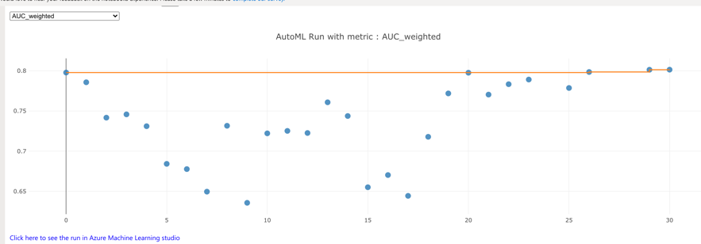
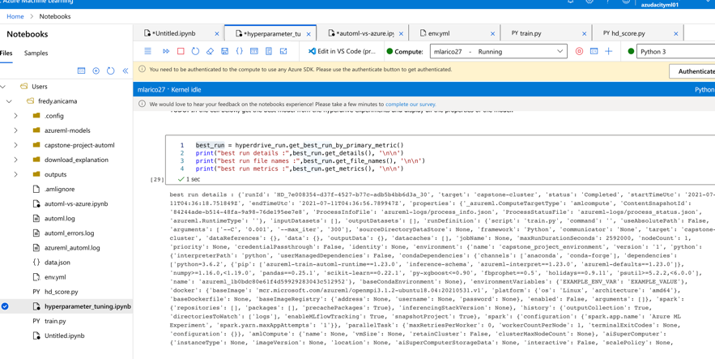
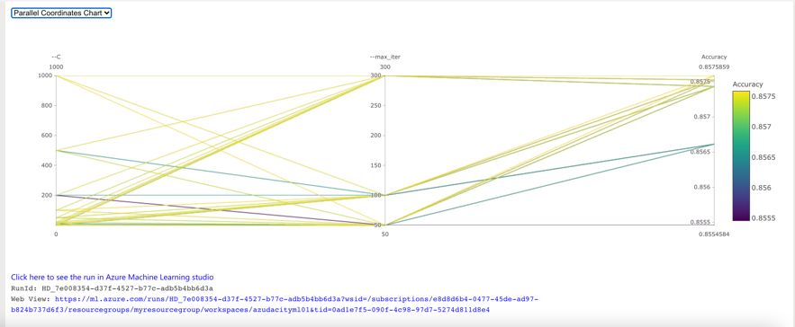
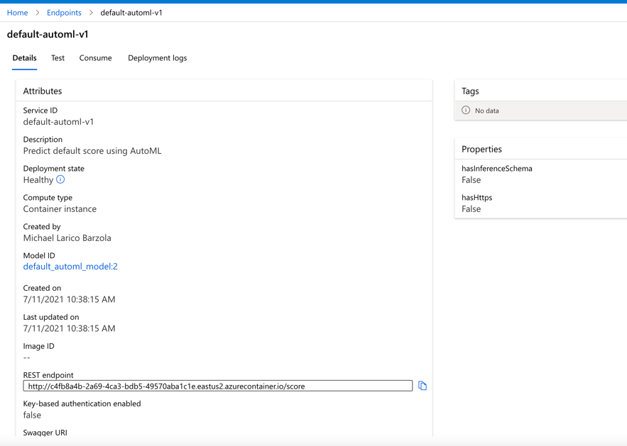
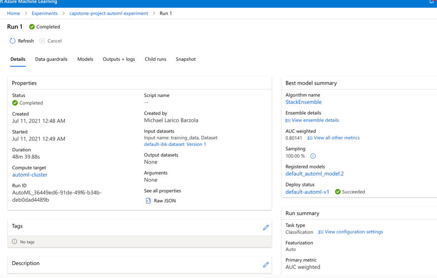
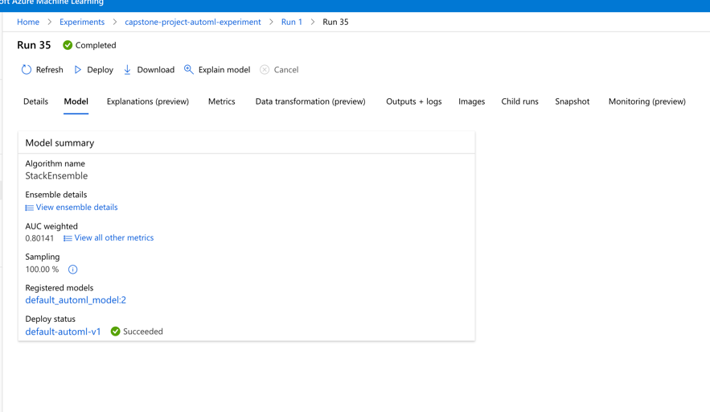

# Capstone Project for Azure Machine Learning Engineer Nanodegree in Udacity

## Table of Content
* [Overview](#overview)
* [Project Set Up and Installation](#project-set-up-and-installation)
* [Dataset](#dataset)
    * [Dataset overview](#dataset-overview)
    * [Task](#task)
    * [Access](#access)
* [Automated ML](#automated-ml)
* [Hyperparameter Tuning](#hyperparameter-tuning)
* [Model Deployment](#model-deployment)
* [Screen Recording](#screen-recording)
* [Future Improvements](#future-improvements)

## Overview

This is the capstone project for the "Machine Learning Engineer for Microsoft Azure" Udacity's Nanodegree. 

In this project, I chose an external dataset from a [Kaggle Competition](https://www.kaggle.com/c/interbank20) organized by a Peruvian Bank where the objective was to predict the default score for the customers. I just used two of the different datasets that the competition offered to the participants and made a preprocessing to get a unique train dataset. 

This dataset will be used to train a model using an Automated ML and a Hyperdrive. After that, I compared the performance of the
two different algorithms and deploy the best model. Finally the endpoint produced was used to get some answers about predictions.

**Figure 1**: Kaggle competition


## Project Set Up and Installation

### Project Files 
In this repo you will find the following files, which were required to run the experiments:
* automl.ipynb :  Notebook file for the AutoML.
* endpoint.py : This is the python script I used to consume the produced endpoint.
* train.py : A python script that the HyperDrive operates on in order to produce the runs and find the best model.
* hyperparameter_tuning.ipynb : This is the notebook file I used for the HyperDrive. 
* dataset_train.csv : Dataset that I used from [here](https://www.kaggle.com/c/interbank20/data).

The following came out from the running of the experiments:
* model.pkl :  The best model from the AutoML I downloaded from Azure ML studio.
* score.py : I downloaded this script from Azure Machine Learning Studio and it is used to deploy the model.
* hyper-model.pkl : This is the best model from the HyperDrive I downloaded from Azure ML studio.

## Dataset

### Dataset overview
The dataset I used is from a [Peruvian Kaggle Competition](https://www.kaggle.com/c/interbank20) where there are like 4 datasets. I just used two of them: rcc_train (dataset about the debts that customers has in the financial system) and se_train (socio economic features about customers). I pre-processed the data before I uploaded to the Azure Machine Learning worskpace in the dataset-preprocessing.ipynb notebook. It describes the financial behaviour of the customers. The data have almost 355K rows of these behaviours recorded from customers.

**Figure 2**: Dataset sample


### Task
I am using this data in order to predict the default event for a customer, that means whether or not the customer will pay its debt.

The features of the data are the following:

* edad: Age of the customer. This feature was normalized.
* est_cvl: Civil status of the customer.
* sit_lab: Employment status of the customer.
* ctd_hijos: Number of customer children.
* flg_sin_email: Flag that expresses whether or not it has an email address.
* ctd_veh: Number of vehicles of the customer.
* tip_lvledu: Type of educational level.
* total_mean_of_saldo_count_per_month: Average # of debts for all months.
* total_sum_of_saldo_count_per_month: Total # of debts for all months.
* total_min_of_saldo_count_per_month: Min # of debts for all months.
* total_max_of_saldo_count_per_month: Max # of debts for all months.
* total_mean_of_saldo_sum_per_month: Average of total amount debt per month for all months.
* total_sum_of_saldo_sum_per_month: Total sum of total amount debt per month for all months.
* total_min_of_saldo_sum_per_month: Min of total amount debt per month for all months.
* total_max_of_saldo_sum_per_month: Max of total amount debt per month for all months.
* total_min_of_saldo_min_per_month: Min amount debt for all months.
* total_mean_of_saldo_min_per_month: 'Minimum amount debt per month' average for all months. 
* total_max_of_saldo_max_per_month: Max amount debt for all months.
* total_mean_of_saldo_max_per_month: 'Maximum amount debt per month' average for all months. 
* total_min_of_condicion_min_per_month: days of minimum delay in all months
* total_mean_of_condicion_min_per_month: 'Minimum delay per month' average for all months.
* total_max_of_condicion_max_per_month: days of maximum delay in all months
* total_mean_of_condicion_max_per_month: 'Maximum delay per month' average for all months.
* total_mean_of_condicion_mean_per_month: 'Mean delay per month' average for all months.

### Access
I upload the dataset in the Azure ML studio from local file **dataset_train.csv** manually. As you can see in either the automl.ipynb and hyperparameter_tuning.ipynb the code is checking whether or not the .csv has been uploaded.

**Figure 3**: Registered dataset in the workspace


**Figure 4**: Details about the Dataset


## Automated ML

The AutoML settings I have used are below :

```
automl_settings = {
                    "experiment_timeout_minutes": 20,
                    "max_concurrent_iterations": 4,
                    "primary_metric" : 'AUC_weighted',
                    "n_cross_validations": 5,
                    "enable_early_stopping": True,
                    "max_cores_per_iteration": -1
                    }
```      

```
automl_config = AutoMLConfig(compute_target=compute_target,
                             task = "classification",
                             training_data=dataset,
                             label_column_name="target",
                             path = project_folder,
                             featurization= 'auto',
                             debug_log = "automl_errors.log",
                             **automl_settings
                            )
```

* ```n_cross_validations``` : The number of cross validations set to make when user validation data is not specified. The main set of data is split to ```n=5``` sets and it is performed train on 4 of the 5 and validation to the another set. So this procedure is performed 5 times, because we have ```n_cross_validations=5```. 

* ```primary_metric = 'AUC_weighted' ``` :  The metric that Automated Machine Learning will optimize for model selection. We have set the 'AUC_weighted' because the class is imbalanced.

* ``` enable_early_stopping = True``` : Whether to enable early termination if the score is not improving in the short term. 

* ``` max_concurrent_iterations = 4``` : The maximum number of iterations that could be executed in parallel.  It is recommended you create a dedicated cluster per experiment, and match the number of max_concurrent_iterations of your experiment to the number of nodes in the cluster. This way, we use all the nodes of the cluster at the same time with the number of concurrent child runs/iterations you want. For this I set it to 4.

* ``` experiment_timeout_minutes = 20 ``` :  It defines how long, in minutes, the experiment should continue to run. In this project we set to 20 minutos, but it's for sure that we could improve for better performance.

* ``` compute_target = compute_target``` : The compute target with specific vm_size and max_nodes. The one that has been configured with name 'automl-cluster' in the automl.ipynb.

* ``` task='classification' ``` : We have a classification task to do, we seek to predict whether or not the person will pay its debt. With other words we are trying to predict the ``` default ``` event.

* ``` training_data = dataset ``` : The data on which the algorithm will be trained.

* ``` label_column_name='target' ``` : The name of the column that contains the labels of the train data, i.e the target column we want to predict.

* ``` path= project_folder``` : The path to the Azure ML folder of the project.

* ``` featurization= 'auto' ``` : Indicator for whether featurization step should be done automatically or not, or whether customized featurization should be used. I used ``` auto``` so featurization step step should be done automatically.

* ``` debug_log = "automl_errors.log" ``` : The debug information are written to the  ```automl_errors.log```.

### Results

In the below screenshots you can verify that the best run is the one at the below table: 
Best algorightm | StackEnsemble
--- | ---  
Run Id | AutoML_36449ed6-91de-49f6-b34b-deb0dad4489b_30
Accuracy | 0.72373
AUC macro | 0.80141
AUC micro | 0.80368
AUC weighted | 0.80141

This screenshot is inside the Jupyter Notebook automl.ipynb. It shows all the details of the best run, its id, its ```automl_settings``` and many other details such as the compute target at which ran:

**Figure 5**: AutoML Best Run - Details from notebook


This screenshot is from the Azure ML studio but not from the Jupyter Notebook. It's in the Experiment Run of AutoML. It shows the best algorithm and its AUC weighted (0.80141).

**Figure 6**: AutoML Experiment - Details from ML Studio


Here we are in the the specific Run of Stacking Ensemble within the general Run of AutoML we see in the above screenshot. It shows the accuracy, AUC micro, AUC macro of this specific algorithm. There are also again other details such as the duration and the id of this specific run:

**Figure 7**: AutoML Best Run - Details from ML Studio


I think that there is a lot of space to improve the above results. Some improvements could be : 
1) I would let the algorithm to run for much more time. Thus I would change  ``` "experiment_timeout_minutes": 20 ``` to an hour or more. 
2) I would disable the early stopping policy and thus set ``` enable_early_stopping = False```.
3) I would include the other data sources provided by the competition in order to create new features.

In the following screenshots we can see the `RunDetails` widget: 
At the below screenshots we can see, back in the Jupyter Notebook automl.ipynb, the Run Details.

**Figure 8**: RunDetails Widget from Notebook


**Figure 9**: RunDetails Widget from Notebook



### AutoML Parameters

The best model from the automl experiment was an Stacking Ensemble of 5 base models with a meta learner of Logistic Regression. Below, there are the base learner with their parameters:

* ``` Base learner 1: ``` :

```
Pipeline(memory=None, steps=[('standardscalerwrapper', StandardScalerWrapper(copy=True, with_mean=False, with_std=False)),
                            ('xgboostclassifier', XGBoostClassifier(booster='gbtree', 
                                                                    colsample_bytree=0.9, 
                                                                    eta=0.01, 
                                                                    gamma=0, 
                                                                    grow_policy='lossguide', 
                                                                    max_bin=255, 
                                                                    max_depth=8, 
                                                                    max_leaves=0, 
                                                                    n_estimators=200, 
                                                                    n_jobs=-1, 
                                                                    objective='reg:logistic', 
                                                                    problem_info=ProblemInfo(...
                                                                                            iteration_timeout_param=None,
                                                                                            feature_column_names=None,
                                                                                            label_column_name=None,
                                                                                            weight_column_name=None,
                                                                                            cv_split_column_names=None,
                                                                                            enable_streaming=None,
                                                                                            timeseries_param_dict=None,
                                                                                            gpu_training_param_dict={'processing_unit_type': 'cpu'}
                                                                    ),
                                                                    random_state=0,
                                                                    reg_alpha=2.0833333333333335,
                                                                    reg_lambda=2.0833333333333335,
                                                                    subsample=0.6,
                                                                    tree_method='hist')
                            )],verbose=False)
```

* ``` Base learner 2: ``` :

```
Pipeline(memory=None, steps=[('maxabsscaler', MaxAbsScaler(copy=True)),
                            ('lightgbmclassifier', LightGBMClassifier(min_data_in_leaf=20,
                                                                        n_jobs=-1, 
                                                                        problem_info=ProblemInfo(
                                                                                            dataset_samples=354663,
                                                                                            dataset_features=81,
                                                                                            dataset_classes=2,
                                                                                            dataset_num_categorical=0,
                                                                                            dataset_categoricals=None,
                                                                                            pipeline_categoricals=None,
                                                                                            dataset_y_std=None,
                                                                                            dataset_uid=None,
                                                                                            subsampli...
                                                                                            subsampling_schedule='hyperband_clip',
                                                                                            cost_mode_param=None,
                                                                                            iteration_timeout_mode=0,
                                                                                            iteration_timeout_param=None,
                                                                                            feature_column_names=None,
                                                                                            label_column_name=None,
                                                                                            weight_column_name=None,
                                                                                            cv_split_column_names=None,
                                                                                            enable_streaming=None,
                                                                                            timeseries_param_dict=None,
                                                                                            gpu_training_param_dict={'processing_unit_type': 'cpu'}
                                                                                            ),
                                                                    random_state=None)
                            )], verbose=False)
```

* ``` Base learner 3: ``` :

```
Pipeline(memory=None, steps=[('maxabsscaler', MaxAbsScaler(copy=True)),
                            ('lightgbmclassifier', LightGBMClassifier(boosting_type='gbdt', 
                                                                    colsample_bytree=0.7922222222222222, 
                                                                    learning_rate=0.1, 
                                                                    max_bin=270, 
                                                                    max_depth=-1, 
                                                                    min_child_weight=7, 
                                                                    min_data_in_leaf=0.020697586206896556, 
                                                                    min_split_gain=0.15789473684210525, 
                                                                    n_estimators=200, 
                                                                    n_jobs=-1, 
                                                                    num_leaves=239, 
                                                                    proble...(
                                                                                iteration_timeout_param=None,
                                                                                feature_column_names=None,
                                                                                label_column_name=None,
                                                                                weight_column_name=None,
                                                                                cv_split_column_names=None,
                                                                                enable_streaming=None,
                                                                                timeseries_param_dict=None,
                                                                                gpu_training_param_dict={'processing_unit_type': 'cpu'}),
                                                                    random_state=None, 
                                                                    reg_alpha=0.2631578947368421, 
                                                                    reg_lambda=0.05263157894736842, 
                                                                    subsample=0.8415789473684211)
        )],verbose=False)
```

* ``` Base learner 4: ``` :

```
Pipeline(memory=None, steps=[('standardscalerwrapper', StandardScalerWrapper(copy=True, with_mean=False, with_std=False)),
                            ('xgboostclassifier', XGBoostClassifier(booster='gbtree',
                                                                    colsample_bytree=1, 
                                                                    eta=0.001, 
                                                                    gamma=0.1, 
                                                                    grow_policy='lossguide', 
                                                                    max_bin=1023, 
                                                                    max_depth=0, 
                                                                    max_leaves=63, 
                                                                    n_estimators=25, 
                                                                    n_jobs=-1, 
                                                                    objective='reg:logistic', 
                                                                    problem_info=ProblemInf...(
                                                                                            iteration_timeout_mode=0,
                                                                                            iteration_timeout_param=None,
                                                                                            feature_column_names=None,
                                                                                            label_column_name=None,
                                                                                            weight_column_name=None,
                                                                                            cv_split_column_names=None,
                                                                                            enable_streaming=None,
                                                                                            timeseries_param_dict=None,
                                                                                            gpu_training_param_dict={'processing_unit_type': 'cpu'}
                                                                                            ),
                                                                    random_state=0, 
                                                                    reg_alpha=0, 
                                                                    reg_lambda=1.7708333333333335, 
                                                                    subsample=0.9, 
                                                                    tree_method='hist')
                        )], verbose=False)
```

* ``` Base learner 5: ``` :

```
Pipeline(memory=None, steps=[('maxabsscaler', MaxAbsScaler(copy=True)),
                            ('xgboostclassifier', XGBoostClassifier(n_jobs=-1, 
                                                                    problem_info=ProblemInfo(
                                                                                            dataset_samples=354663,
                                                                                            dataset_features=81,
                                                                                            dataset_classes=2,
                                                                                            dataset_num_categorical=0,
                                                                                            dataset_categoricals=None,
                                                                                            pipeline_categoricals=None,
                                                                                            dataset_y_std=None,
                                                                                            dataset_uid=None,
                                                                                            subsampling=False,
                                                                                            task='classif...
                                                                                            subsampling_schedule='hyperband_clip',
                                                                                            cost_mode_param=None,
                                                                                            iteration_timeout_mode=0,
                                                                                            iteration_timeout_param=None,
                                                                                            feature_column_names=None,
                                                                                            label_column_name=None,
                                                                                            weight_column_name=None,
                                                                                            cv_split_column_names=None,
                                                                                            enable_streaming=None,
                                                                                            timeseries_param_dict=None,
                                                                                            gpu_training_param_dict={'processing_unit_type': 'cpu'}
                                                                                            ), 
                                                                    random_state=0, 
                                                                    tree_method='auto')
                            )], verbose=False)
```

* ``` Meta learner: ``` :

```
LogisticRegressionCV(
                        Cs=10,
                        class_weight=None,
                        cv=None,
                        dual=False,
                        fit_intercept=True,
                        intercept_scaling=1.0,
                        l1_ratios=None,
                        max_iter=100,
                        multi_class='auto',
                        n_jobs=None,
                        penalty='l2',
                        random_state=None,
                        refit=True,
                        scoring=<azureml.automl.runtime.stack_ensemble_base.Scorer object at 0x7fb2792c24e0>,
                        solver='lbfgs',
                        tol=0.0001,
                        verbose=0
    )
```

For example, the first base learner contains the following parameters:

* ``` colsample_bytree = 0.9``` :  is the subsample ratio of columns when constructing each tree. Subsampling occurs once for every tree constructed.

* ``` eta = 0.1``` : Step size shrinkage used in update to prevents overfitting. After each boosting step, we can directly get the weights of new features, and eta shrinks the feature weights to make the boosting process more conservative.

* ``` gamma = 0``` : Minimum loss reduction required to make a further partition on a leaf node of the tree. The larger gamma is, the more conservative the algorithm will be.

* ``` max_depth = 8``` : Maximum depth of a tree. Increasing this value will make the model more complex and more likely to overfit. 0 is only accepted in lossguided growing policy when tree_method is set as hist or gpu_hist and it indicates no limit on depth. Beware that XGBoost aggressively consumes memory when training a deep tree.

* ``` max_leaves = 0``` : Maximum number of nodes to be added.

* ``` n_estimators = 200``` : Number of trees trained on.

* ``` reg_alpha = 2.0833333333333335``` : L1 regularization term on weights. Increasing this value will make model more conservative.

* ``` reg_lambda = 2.0833333333333335``` : L2 regularization term on weights. Increasing this value will make model more conservative. Normalised to number of training examples.

* ``` subsample = 0.6``` : Subsample ratio of the training instances. Setting it to 0.5 means that XGBoost.

## Hyperparameter Tuning

The algorithm chosen for the training is Logistic Regression because the data is normalized and also regression models are more imterpretable. The two hyperparameters of the Logistic Regression are tuned with the hyperdrive to find the model with the best accuracy on the validation set. The two hyperparameters are the following:

* ``` C ``` : The inverse of the reqularization strength. The smaller the number the stronger the regularization.
* ``` max_iter ```: Maximum number of iterations to converge.

**Benefits of the parameter sampler**

I chose the ```RandomParameterSampling```, the hyperparameters are randomly selected from the search space. The search space for the two hyperaparameters is the following:

```
   '--C' : choice(0.001,0.01,0.1,1,10,20,50,100,200,500,1000),
   '--max_iter': choice(50,100,300)
```

where the choice define discrete space over the values. The benefits of the ```RandomParameterSampling```, is that it is more fast than for example the ```GridParameterSampling``` where all the possible values from the search space are used, and it supports early termination of low-performance runs.

I chose the ```BanditPolicy``` which is an "aggressive" early stopping policy with the meaning that cuts more runs than a conservative one like the ```MedianStoppingPolicy```, so it saves computational time. There are three configuration parameters ```slack_factor, evaluation_interval(optional), delay_evaluation(optional)```. 

* ```slack_factor/slack_amount``` : (factor) The slack allowed with respect to the best performing training run.(amount) Specifies the allowable slack as an absolute amount, instead of a ratio.

* ```evaluation_interval``` : (optional) The frequency for applying the policy.

* ```delay_evaluation``` : (optional) Delays the first policy evaluation for a specified number of intervals.

I set ```delay_evaluation=5, evaluation_interval=2, slack_factor=0.1```.

About the other parameters of the ```HyperDriveConfig``` : 

* ```primary_metric_name='Accuracy'``` : Meaning that our interest is about the 'Accuracy'. 

* ```primary_metric_goal=PrimaryMetricGoal.MAXIMIZE```: Meaning that we want to Maximize the primary metric and not minimize it for example.

* ```policy=early_termination_policy``` : This is where I have set the policy I described above.

* ```max_concurrent_runs=4 ``` : Maximum number of runs to run concurrently. Of course the best is 4 as it is the number of cluster nodes.

* ```max_total_runs=50``` : Maximum number of runs.

### Results

In the below screenshots you can verify that the best run is the one at the below table: 
runId | HD_7e008354-d37f-4527-b77c-adb5b4bb6d3a_30
--- | ---  
 Accuracy | 0.858
 Regularization Strength  | 0.001
 Max Iterations | 300
 
This screenshot is inside the Jupyter Notebook hyperparameter_tuning.ipynb shows all the details of the best run, its id, its ```automl_settings``` and many other details such as the compute target at which ran:


**Figure 10**: HyperDrive Experiment - Details from notebook


The below screenshots are from the Azure ML studio but not from the Jupyter Notebook. It is in the Experiment section in the Run of Hyperdrive inside the best Run. The best Run here is not another algorithm but specific parameters (C,max_iter) of the same algorithm applies to each run inside the Hyperdrive run: 


**Figure 11**: HyperDrive Experiment - Details from ML Studio


**Figure 12**: HyperDrive Best Run - Details from ML Studio


We can understand that there is a lot of difference from the perspective of accuracy between the Hyperdrive and the AutoML since the last hit an accuracy of ```0.72373``` and the hyperdive's accuracy is ```0.858```. Some improvements for the Hypderdrive method could be :

1) Set a ```GridParameterSampling``` so we can check more hyperparameters for better results.
2) Change the policy to a more "conservative" one. I would set as policy the ```MedianStoppingPolicy``` so the runs wouldn't stop more easy.
3) Set as ```max_total_runs``` a much more big number.

In the following screenshots we can see the `RunDetails` widget : 
At the below screenshots we can see, back in the Jupyter Notebook hyperparameter_tuning.ipynb, the Run Details.

**Figure 13**: HyperDrive Experiment - RunDetails Widget from Notebook


**Figure 14**: HyperDrive Experiment - RunDetails Widget from Notebook


**Figure 15**: HyperDrive Experiment - RunDetails Widget from Notebook


## Model Deployment
The best model came out from the AutoML, this is sure from what we have seen from the above results. 
The model that I have deployed in order to consume it is the one that produced with the StackingEnsemble algorithm.

About the deployment configurations, I will analyse some of them : 
``` 
aci_config = AciWebservice.deploy_configuration(cpu_cores = 1, 
                                                       memory_gb = 4, 
                                                       enable_app_insights= True)
```
* ``` AciWebservice ```: A deployed service is created from a model, script, and associated files. The resulting web service is a load-balanced, HTTP endpoint with a REST API. 
* ``` enable_app_insights = True ```: Whether or not to enable AppInsights for this Webservice. I have enabled it and you can see exactly what is it viewing my screen recording video.

Below you can see the screenshots of the endpoint as active.
This screenshot is from inside the aciservice(the endpoint). It shows the endpoint as Healthy(up and left), the rest endpoint you must call it in order to consume the endpoint(down and left) and also the Swagger URI. It also shows which model has been deployed(middle left). 

**Figure 16**: Model deployment - Status of the Service


This screenshot shows the Deploy Status as Succeeded(middle right). This is inside the Experiment Run of AutoML.

**Figure 17**: Model deployment - Experiment Run


This screenshot shows the Deploy Status as Succeeded(left). This is inside the best Run of the Run of AutoML.

**Figure 18**: HyperDrive Experiment - Experiment Best Run


### Model Consumption

In order to consume the model, you just need to send a request with data as an input:

* Input: 

```json
data = {"data":
        [
        {"key_value": 62,
        "edad": -1.3623451,
        "sexo": 1.0,
        "est_cvl": 4.0,
        "sit_lab": 1.0,
        "ctd_hijos": 0.0,
        "flg_sin_email": 1.0,
        "ctd_veh": 0.0,
        "tip_lvledu": 7.0,
        "total_mean_of_saldo_count_per_month": 2.5,
        "total_sum_of_saldo_count_per_month": 30,
        "total_min_of_saldo_count_per_month": 2,
        "total_max_of_saldo_count_per_month": 4,
        "total_mean_of_saldo_sum_per_month": 2.3570971,
        "total_sum_of_saldo_sum_per_month": 28.285166,
        "total_min_of_saldo_sum_per_month": 1.8607771,
        "total_max_of_saldo_sum_per_month": 3.949139,
        "total_min_of_saldo_min_per_month": 0.92711896,
        "total_mean_of_saldo_min_per_month": 0.9273224,
        "total_max_of_saldo_max_per_month": 1.04637,
        "total_mean_of_saldo_max_per_month": 0.9552064,
        "total_min_of_condicion_min_per_month": 0,
        "total_mean_of_condicion_min_per_month": 0.0,
        "total_max_of_condicion_max_per_month": 0,
        "total_mean_of_condicion_max_per_month": 0.0,
        "total_mean_of_condicion_mean_per_month": 0.0
        },
        {
        "key_value": 21,
        "edad": 0.15243018,
        "sexo": 0.0,
        "est_cvl": 4.0,
        "sit_lab": 1.0,
        "ctd_hijos": 0.0,
        "flg_sin_email": 1.0,
        "ctd_veh": 0.0,
        "tip_lvledu": 0.0,
        "total_mean_of_saldo_count_per_month": 13.416666666666666,
        "total_sum_of_saldo_count_per_month": 161,
        "total_min_of_saldo_count_per_month": 6,
        "total_max_of_saldo_count_per_month": 20,
        "total_mean_of_saldo_sum_per_month": 13.418651,
        "total_sum_of_saldo_sum_per_month": 161.0238,
        "total_min_of_saldo_sum_per_month": 6.3681345,
        "total_max_of_saldo_sum_per_month": 19.67877,
        "total_min_of_saldo_min_per_month": 0.92711896,
        "total_mean_of_saldo_min_per_month": 0.92711896,
        "total_max_of_saldo_max_per_month": 1.1543791,
        "total_mean_of_saldo_max_per_month": 1.1356059,
        "total_min_of_condicion_min_per_month": 0,
        "total_mean_of_condicion_min_per_month": 0.0,
        "total_max_of_condicion_max_per_month": 333,
        "total_mean_of_condicion_max_per_month": 171.08333333333334,
        "total_mean_of_condicion_mean_per_month": 52.30934095860567
        }
      ]
    }
``` 

* Python script:

```python
# URL for the web service, should be similar to:
scoring_uri = 'http://d25816c7-213d-4011-a940-892d59545e0f.eastus2.azurecontainer.io/score'
# If the service is authenticated, set the key or token
key = 'w7Nuinf2vMFxbThjOt8Wci6HCgOuQanG'

# Set the content type
headers = {'Content-Type': 'application/json'}
# If authentication is enabled, set the authorization header
headers['Authorization'] = f'Bearer {key}'

# Make the request and display the response
resp = requests.post(scoring_uri, input_data, headers=headers)
print(resp.json())
``` 

## Screen Recording

[Here](https://youtu.be/kGlXMuFMBMw) you can see a screen recording which shows : 
- A working model
- Demo of the deployed  model
- Demo of a sample request sent to the endpoint and its response

## Future Improvements

* I have pointed the future improvements I would suggest for both the AutoML and the HyperDrive in the corresponding sections. 
* About the dataset I would suggest to increase the other data sources in order to create new features.
* Benchmarking can be done using Apache Benchmark command-line tool to keep the performance of the model in check and above a standard level. It is used to determine the response time in seconds for the model that is deployed. 
* We could try different models to get the best possible one. 
* If we reduced the duration of the experiment or increased the number of processes running in parallel then the experiment will be fast and time can be save - however resource costs may increase. 
* The use of the Kubernetes service can be helpful in case we add more data to the existing dataset. 
* Lastly, the exploration of possibly using Deep Learning to get to a more accurate model.